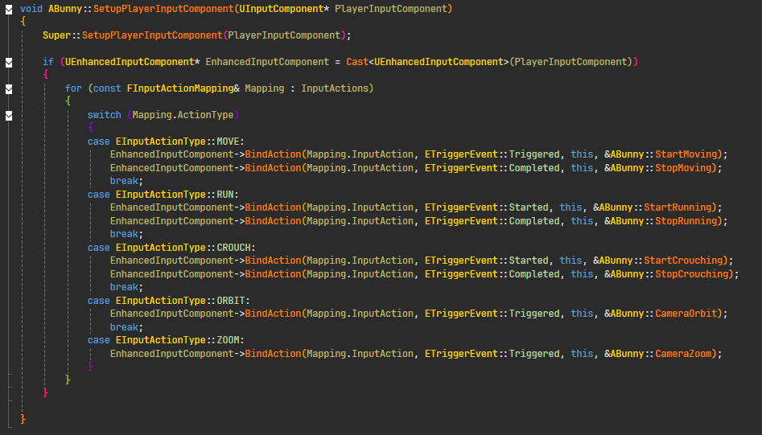

## Top-Down Controller – UE5 C++ Demo

This is a demonstration of a fully functional top-down character controller built in C++ for Unreal Engine 5.

# Features

- Smooth character movement with Idle, Walk, Sprint, and Crouch states
- Camera orbit and zoom functionality
- Clean state-based architecture using UE5’s Enhanced Input System

